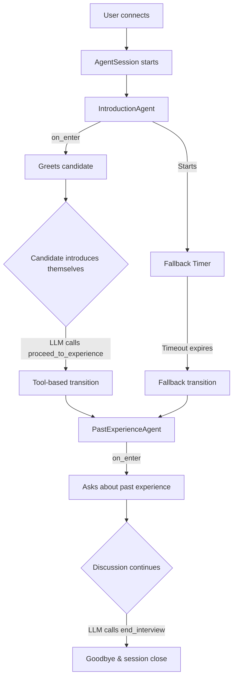
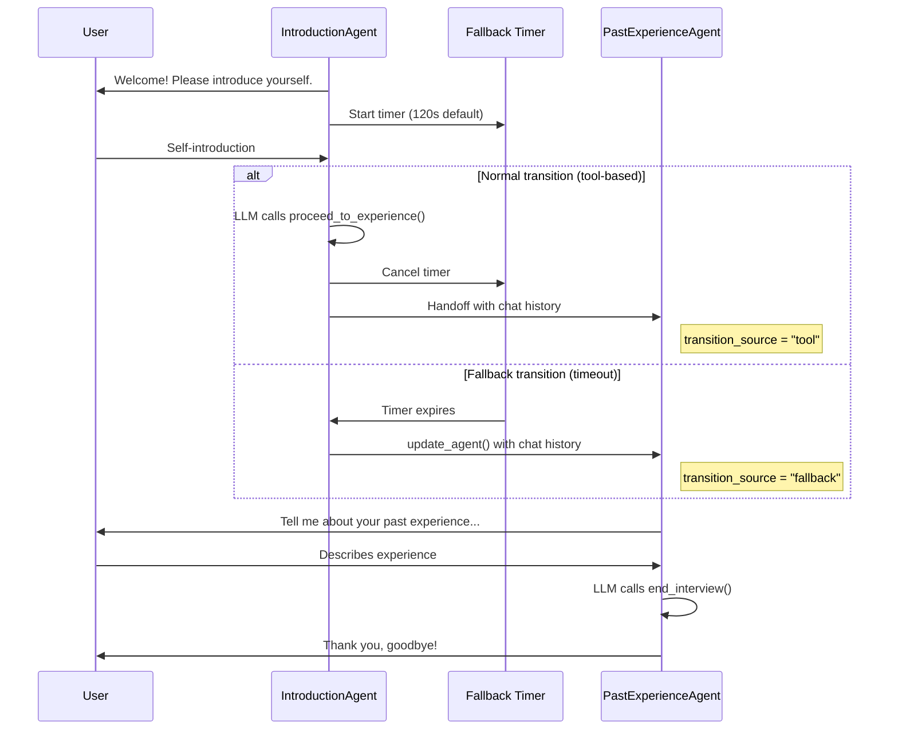
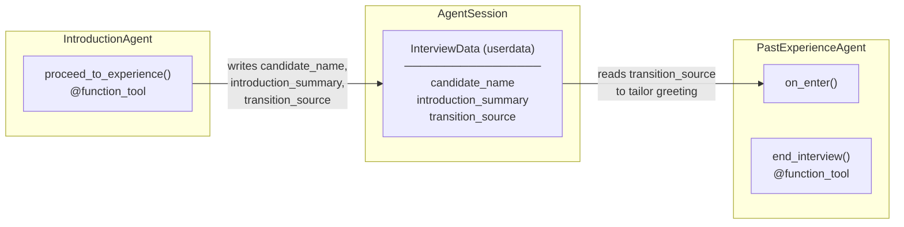

# AI Mock Interview Demo

A multi-stage voice interview agent built on the [LiveKit Agents](https://github.com/livekit/agents) framework. The agent conducts a mock interview with two stages — **self-introduction** and **past experience** — featuring smooth transitions and a time-based fallback mechanism.

## Features

- **Two-stage interview flow**: Self-introduction followed by past-experience discussion
- **Smart transitions**: LLM-driven tool calls trigger natural stage transitions
- **Fallback mechanism**: Time-based fallback ensures the interview progresses even if the normal transition logic isn't triggered
- **Conversation continuity**: Full chat history is preserved across stage transitions
- **Shared state**: Candidate information persists across agents via shared userdata

## Architecture

### System Overview



### Stage Transition Flow

The system supports two paths for transitioning from the introduction stage to the experience stage:



### Data Flow



## Project Structure

```
mock_interview_demo/
├── src/
│   ├── __init__.py
│   ├── main.py          # Application entrypoint (AgentServer + CLI)
│   ├── agents.py         # IntroductionAgent and PastExperienceAgent
│   ├── data.py           # InterviewData dataclass (shared state)
│   └── config.py         # Configurable constants (fallback timeouts)
├── tests/
│   ├── __init__.py
│   ├── conftest.py       # Test fixtures and path setup
│   ├── test_agents.py    # Unit tests for agent properties
│   └── test_transitions.py  # Integration tests for transitions
├── docs/
│   └── AI_Mock_Interview_Demo.docx  # Original specification
└── assets/               # Static assets (reserved for future use)
```

## Quick Start

### Prerequisites

- Python 3.10+
- [uv](https://docs.astral.sh/uv/) package manager (recommended) or pip
- API keys for LLM/STT/TTS providers

### 1. Install dependencies

The project uses the LiveKit Agents framework from the local `livekit_agents/` directory. From the repository root:

```bash
cd livekit_agents
python3 -m uv sync --all-extras --dev
```

### 2. Configure environment

Create a `.env` file in the project root:

```bash
OPENAI_API_KEY=sk-...
GOOGLE_APPLICATION_CREDENTIALS=path/to/service-account.json
```

For dev/start modes (connecting to a LiveKit server), also add:

```bash
LIVEKIT_URL=wss://your-project.livekit.cloud
LIVEKIT_API_KEY=...
LIVEKIT_API_SECRET=...
```

### 3. Run the demo

```bash
# Text mode — type in terminal, no audio hardware needed
python -m src.main console --text

# Audio mode — real-time voice conversation via local mic/speaker
python -m src.main console

# Dev mode — connects to LiveKit server with hot reload
python -m src.main dev
```

## How It Works

### IntroductionAgent

The first agent greets the candidate and asks them to introduce themselves. It listens to the candidate's response and, once the LLM determines the introduction is complete, it calls the `proceed_to_experience` tool with the candidate's name and a summary.

**Fallback mechanism**: On entering the stage, a background timer starts (default: 120 seconds). If the LLM doesn't call `proceed_to_experience` within this window, the timer forces a transition to `PastExperienceAgent`. The timer is cancelled if the normal tool-based transition fires first.

### PastExperienceAgent

The second agent asks about the candidate's past work experience, projects, and achievements. It tailors its opening based on how the transition occurred:

- **Tool-based transition**: Thanks the candidate for their introduction and naturally pivots to experience questions.
- **Fallback transition**: Smoothly bridges to experience questions without awkwardly referencing a missed transition.

When the discussion is sufficient, the LLM calls `end_interview` to close the session gracefully.

### Shared State

Both agents share an `InterviewData` dataclass via `AgentSession.userdata`:

| Field | Type | Description |
|-------|------|-------------|
| `candidate_name` | `str \| None` | Candidate's name, extracted during introduction |
| `introduction_summary` | `str \| None` | Brief summary of the candidate's introduction |
| `transition_source` | `str \| None` | `"tool"` or `"fallback"` — how the transition occurred |

## Configuration

Configurable constants in `src/config.py`:

| Constant | Default | Description |
|----------|---------|-------------|
| `INTRODUCTION_FALLBACK_TIMEOUT` | `120.0` | Seconds before fallback forces transition from introduction to past-experience stage |

## Testing

```bash
# Run all tests
.venv/bin/python -m pytest tests/ -v

# Run unit tests only
.venv/bin/python -m pytest tests/test_agents.py -v

# Run integration tests only
.venv/bin/python -m pytest tests/test_transitions.py -v

# Run a specific test
.venv/bin/python -m pytest tests/test_agents.py -k "test_has_proceed_tool" -v
```

### Test Coverage

| Test File | What It Tests |
|-----------|---------------|
| `test_agents.py` | Agent construction, instructions, tool registration, chat context acceptance |
| `test_transitions.py` | Fallback timer behavior, chat context inheritance, userdata persistence |

## Technology Stack

- **Framework**: [LiveKit Agents](https://github.com/livekit/agents) (Python)
- **LLM**: OpenAI GPT-4.1-mini
- **Speech-to-Text**: Google Cloud Speech-to-Text
- **Text-to-Speech**: Google Cloud Text-to-Speech
- **Voice Activity Detection**: Silero VAD
