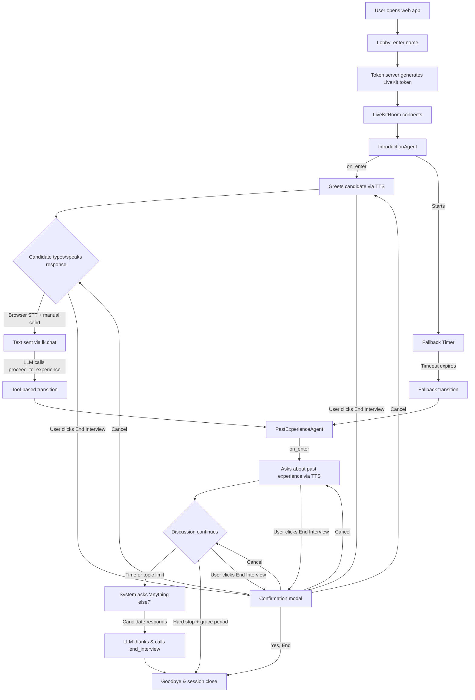
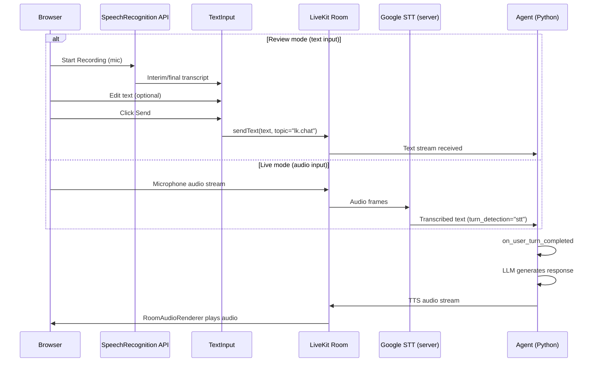
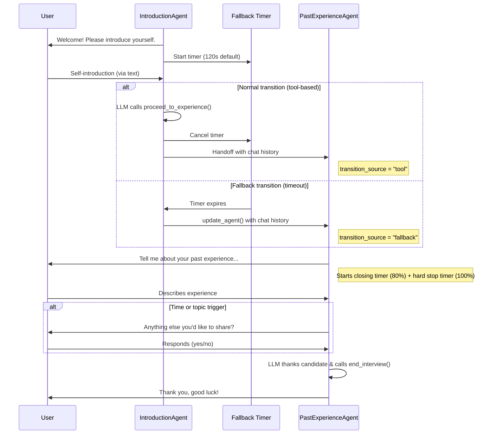

# AI Mock Interview Demo

A multi-stage interview agent built on the [LiveKit Agents](https://github.com/livekit/agents) framework, with a React web frontend. The agent conducts a mock interview with two stages — **self-introduction** and **past experience** — featuring CV-aware personalization, smooth transitions, and a time-based fallback mechanism.

## Features

- **Two-stage interview flow**: Self-introduction followed by past-experience discussion
- **CV-aware personalization**: Parses the candidate's CV PDF to greet them by name and ask targeted questions about their specific experience, projects, and skills
- **Dual input modes**: Review mode (browser speech recognition → editable text) and Live mode (server-side Google STT for real-time voice conversation)
- **STT keyword boosting**: Extracts key terms from the CV (names, companies, skills) and passes them to Google STT as phrase hints for improved transcription accuracy
- **Smart transitions**: LLM-driven tool calls trigger natural stage transitions
- **Fallback mechanism**: Time-based fallback ensures the interview progresses even if the normal transition logic isn't triggered
- **End Interview button**: Users can end the interview at any time via a confirmation dialog
- **Response brevity**: Agent responses are limited to 1-3 sentences via prompt rules and `max_completion_tokens`
- **Transcript persistence**: Conversation transcript is saved to `data/{code}/transcripts/` as JSON at session end
- **Web frontend**: React app with browser-based speech recognition, editable text input, and transcript panel
- **Conversation continuity**: Full chat history is preserved across stage transitions
- **Shared state**: Candidate information persists across agents via shared userdata

## Architecture

### System Overview



### Input Flow

The agent supports **dual input modes** — text and audio:



### Stage Transition Flow



## Project Structure

```
mock_interview_demo/
├── src/
│   ├── __init__.py
│   ├── main.py          # Application entrypoint (AgentServer + CLI + serve command + debug logging)
│   ├── agents.py         # InterviewAgentBase, IntroductionAgent, PastExperienceAgent
│   ├── cv_loader.py      # CV PDF text extraction (pypdf) + LLM metadata extraction
│   ├── data.py           # InterviewData dataclass (shared state)
│   ├── config.py         # Configurable constants (timeouts, token limits, endpointing)
│   └── server.py         # FastAPI token server (POST /api/token)
├── data/
│   └── {interview_code}/
│       ├── cv/            # Candidate CV PDFs (placed by admin)
│       └── transcripts/   # Interview transcripts (generated at runtime)
├── frontend/
│   ├── src/
│   │   ├── pages/
│   │   │   ├── LobbyPage.tsx       # Name input + start button
│   │   │   └── InterviewPage.tsx    # LiveKit room, transcript, controls
│   │   ├── components/
│   │   │   ├── RecordingControls.tsx # Browser SpeechRecognition (Start/Pause/Resume)
│   │   │   ├── TextInput.tsx         # Editable text input + Send button
│   │   │   ├── TranscriptPanel.tsx   # Scrolling transcript display
│   │   │   └── EndInterviewModal.tsx # Confirmation dialog for ending interview
│   │   └── lib/
│   │       └── api.ts               # Token fetch helper
│   ├── package.json
│   ├── tsconfig.json
│   └── vite.config.ts
├── tests/
│   ├── __init__.py
│   ├── conftest.py       # Test fixtures and path setup
│   ├── test_agents.py    # Unit tests for agent properties and keyword matching
│   └── test_transitions.py  # Integration tests for transitions
└── docs/
    └── AI_Mock_Interview_Demo.docx  # Original specification
```

## Quick Start

### Prerequisites

- Python 3.10+
- Node.js 18+
- [uv](https://docs.astral.sh/uv/) package manager (recommended) or pip
- API keys for OpenAI (LLM) and Google Cloud (TTS)
- LiveKit Cloud account or self-hosted LiveKit server

### 1. Install Python dependencies

From `mock_interview_demo/`:

```bash
# Install livekit-agents and plugins from local source
.venv/Scripts/pip install -e ../livekit_agents/livekit-agents
.venv/Scripts/pip install -e ../livekit_agents/livekit-plugins/livekit-plugins-google
.venv/Scripts/pip install -e ../livekit_agents/livekit-plugins/livekit-plugins-openai

# Install additional dependencies
.venv/Scripts/pip install pypdf  # CV PDF text extraction

# Install dev tools
.venv/Scripts/pip install pytest pytest-asyncio ruff
```

### 2. Install frontend dependencies

```bash
cd frontend && npm install
```

### 3. Configure environment

Create a `.env` file in `mock_interview_demo/`:

```bash
OPENAI_API_KEY=sk-...
GOOGLE_APPLICATION_CREDENTIALS=path/to/service-account.json
LIVEKIT_URL=wss://your-project.livekit.cloud
LIVEKIT_API_KEY=...
LIVEKIT_API_SECRET=...
```

### 4. Run the demo

You need three terminals:

```bash
# Terminal 1: Agent worker (connects to LiveKit server)
.venv/Scripts/python -m src.main dev

# Terminal 2: Token server (FastAPI on port 8000)
.venv/Scripts/python -m src.main serve

# Terminal 3: Frontend dev server (port 5173)
cd frontend && npm run dev
```

Then open `http://localhost:5173` in your browser.

### Console mode (no frontend)

```bash
# Text mode — type in terminal, no audio hardware needed
.venv/Scripts/python -m src.main console --text

# Audio mode — real-time voice conversation via local mic/speaker
.venv/Scripts/python -m src.main console
```

## How It Works

### InterviewAgentBase

All interview agents inherit from `InterviewAgentBase`, which handles the **End Interview** command sent by the frontend button. When the user confirms ending, the frontend sends `"end interview"` via `lk.chat`. The base class detects this exact text in `on_user_turn_completed()`, generates a goodbye message via TTS, and suppresses further LLM processing.

### IntroductionAgent

The first agent greets the candidate and gathers their introduction. If a CV is available, it greets the candidate by name (extracted from CV) and skips asking for their name. If no CV is provided, it falls back to asking for the candidate's name, current role, and background one detail at a time. Once the LLM determines the introduction is complete, it calls `proceed_to_experience` with the candidate's name and a summary.

**Fallback mechanism**: On entering the stage, a background timer starts (default: 120 seconds). If the LLM doesn't call `proceed_to_experience` within this window, the timer forces a transition. The timer is cancelled if the normal tool-based transition fires first.

### PastExperienceAgent

The second agent asks about the candidate's past work experience, projects, and achievements. If a CV is available, it identifies distinct experiences from the CV and asks about up to `MAX_EXPERIENCE_TOPICS` (default: 3) of the most relevant ones. `on_enter()` generates the first experience question for both transition types (tool-based and fallback) with tailored instructions. The IntroductionAgent is instructed NOT to ask experience questions alongside the `proceed_to_experience` tool call — just a brief acknowledgment — so the first experience question comes reliably from `on_enter()`.

Each experience topic is limited to `MAX_TURNS_PER_TOPIC` (default: 3) candidate turns — 1 initial answer + up to 2 follow-ups. After exploring a topic, the LLM calls the `record_experience` tool with a brief summary before moving to the next topic. If the LLM exceeds the turn limit without calling the tool, the system flags a **deferred advance** — it lets the current LLM reply finish naturally, then advances to the next topic on the next candidate turn. This prevents the interviewer from being cut off mid-sentence.

The experience stage ends based on **whichever comes first**:

- **Time trigger**: At 80% of `EXPERIENCE_STAGE_TIMEOUT` (default: 2:24 of 3 min), the system injects an "anything else you'd like to share?" closing question.
- **Topic trigger**: After the LLM has called `record_experience` for `MAX_EXPERIENCE_TOPICS` (default: 3) distinct experience topics, the tool returns instructions to ask the same closing question.

After the closing question, the candidate can optionally share one more experience before the LLM wraps up.

**Graceful hard stop**: At 100% timeout, the agent waits for the candidate to finish speaking (up to `EXPERIENCE_GRACE_PERIOD` = 30s), then generates a goodbye and shuts down the session directly. If the grace period expires, the agent interrupts politely, apologizes for running out of time, and ends the session. Both paths call `session.shutdown(drain=True)` directly rather than relying on the LLM to call `end_interview`. A `_shutdown_initiated` guard flag prevents duplicate goodbye messages when multiple shutdown paths race.

### Frontend

The React frontend connects to the LiveKit room and supports two input modes:

1. **Review mode**: **RecordingControls** uses the browser's `SpeechRecognition` API for local dictation. Transcribed text appears in **TextInput** for review and editing. The user clicks **Send** to transmit text via `lk.chat`.
2. **Live mode**: Microphone audio is published directly to the LiveKit room. Server-side Google STT transcribes it in real-time with configurable endpointing delays.
3. The agent responds via TTS, which plays through `RoomAudioRenderer`.
4. The **End Interview** button shows a confirmation modal. If the user confirms, `"end interview"` is sent to the agent, which triggers a goodbye message via TTS.

### Shared State

Both agents share an `InterviewData` dataclass via `AgentSession.userdata`:

| Field | Type | Description |
|-------|------|-------------|
| `interview_code` | `str \| None` | Interview code extracted from room name |
| `started_at` | `float \| None` | Session start timestamp (for transcript) |
| `candidate_name` | `str \| None` | Candidate's name — from CV at startup or from introduction |
| `introduction_summary` | `str \| None` | Brief summary of the candidate's introduction |
| `transition_source` | `str \| None` | `"tool"` or `"fallback"` — how the transition occurred |
| `cv_text` | `str \| None` | Raw CV text injected into agent instructions |
| `stt_keywords` | `list[tuple[str, float]]` | CV-extracted keywords passed to Google STT as phrase hints |
| `experience_topics_discussed` | `int` | Count of distinct experience topics fully explored (via `record_experience` tool or turn-limit force-advance) |
| `current_topic_turns` | `int` | Candidate turns on the current topic (reset when topic changes) |
| `closing_question_asked` | `bool` | Whether the "anything else?" closing question has been asked |

## Configuration

Configurable constants in `src/config.py`:

| Constant | Default | Description |
|----------|---------|-------------|
| `INTRODUCTION_FALLBACK_TIMEOUT` | `120.0` | Seconds before fallback forces transition from introduction to experience stage |
| `MAX_COMPLETION_TOKENS` | `150` | Hard ceiling on LLM response length (~2-3 sentences) |
| `MIN_ENDPOINTING_DELAY` | `3.0` | Minimum silence (seconds) before treating a turn as complete |
| `MAX_ENDPOINTING_DELAY` | `6.0` | Maximum wait (seconds) before forcing a turn to end |
| `EXPERIENCE_STAGE_TIMEOUT` | `180.0` | Total time budget (seconds) for the past-experience stage |
| `EXPERIENCE_CLOSING_THRESHOLD` | `0.8` | Fraction of timeout at which the "anything else?" closing question fires |
| `MAX_EXPERIENCE_TOPICS` | `3` | Maximum CV experiences to ask about before the closing question |
| `MAX_TURNS_PER_TOPIC` | `3` | Maximum candidate turns per topic before force-advancing (1 initial + 2 follow-ups) |
| `EXPERIENCE_GRACE_PERIOD` | `30.0` | Extra seconds after timeout to let the candidate finish before interrupting |

## Testing

```bash
# Run all tests
.venv/Scripts/python -m pytest tests/ -v

# Run unit tests only
.venv/Scripts/python -m pytest tests/test_agents.py -v

# Run integration tests only
.venv/Scripts/python -m pytest tests/test_transitions.py -v

# Run a specific test
.venv/Scripts/python -m pytest tests/test_agents.py -k "test_has_proceed_tool" -v
```

### Test Coverage

| Test File | What It Tests |
|-----------|---------------|
| `test_agents.py` | Agent construction, instructions, tool registration, end-interview detection, conversation rules, config values |
| `test_transitions.py` | Fallback timer behavior, chat context inheritance, userdata persistence |

## Technology Stack

- **Framework**: [LiveKit Agents](https://github.com/livekit/agents) (Python)
- **LLM**: OpenAI GPT-4.1-mini
- **Speech-to-Text**: Google Cloud STT (server-side, Live mode) + Browser SpeechRecognition API (client-side, Review mode)
- **Text-to-Speech**: Google Cloud TTS (Chirp 3)
- **CV Parsing**: pypdf (PDF text extraction)
- **Frontend**: React + TypeScript + Vite
- **Token Server**: FastAPI + Uvicorn
- **Real-time Transport**: LiveKit (WebRTC)
