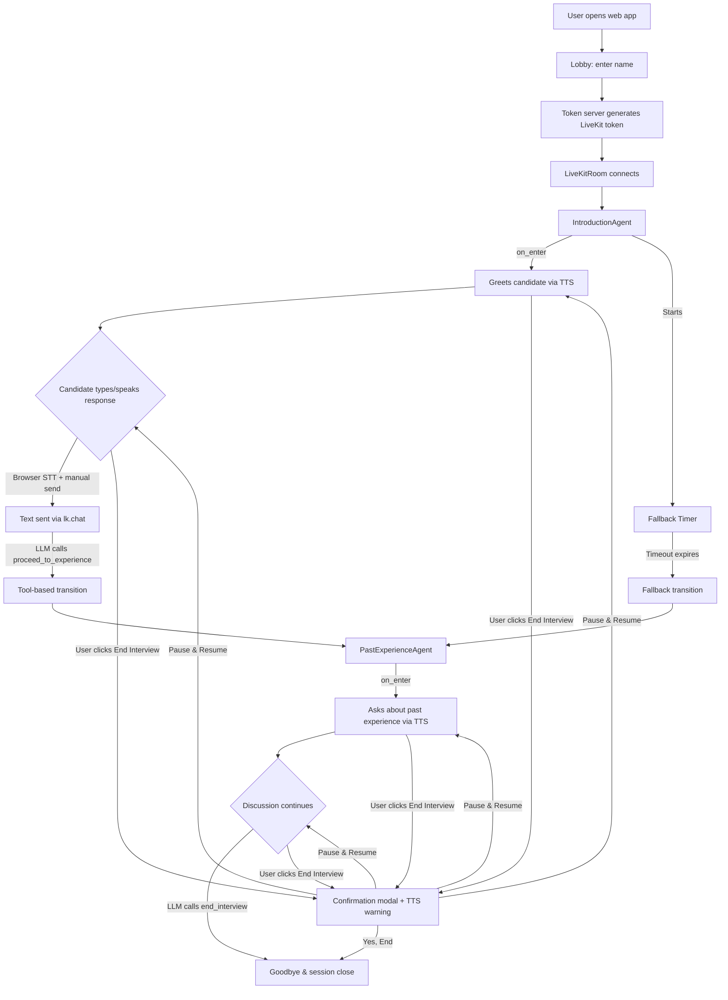
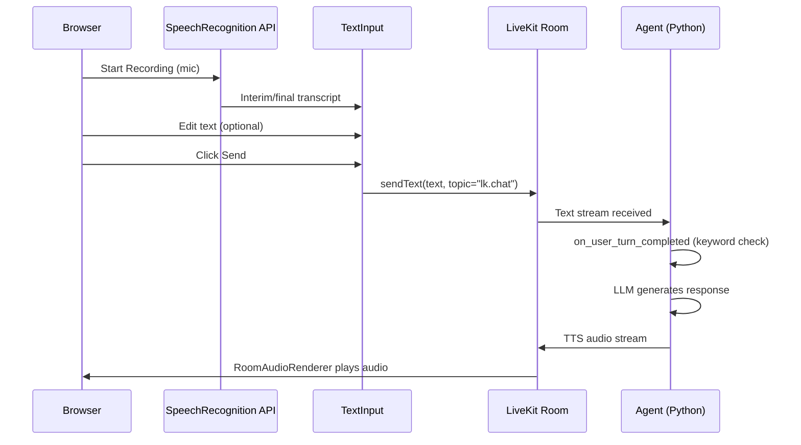

# AI Mock Interview Demo

A multi-stage interview agent built on the [LiveKit Agents](https://github.com/livekit/agents) framework, with a React web frontend. The agent conducts a mock interview with two stages — **self-introduction** and **past experience** — featuring smooth transitions, flow control, and a time-based fallback mechanism.

## Features

- **Two-stage interview flow**: Self-introduction followed by past-experience discussion
- **Smart transitions**: LLM-driven tool calls trigger natural stage transitions
- **Fallback mechanism**: Time-based fallback ensures the interview progresses even if the normal transition logic isn't triggered
- **Flow control**: Users can stop, pause, and resume the interview via keywords or the End Interview button
- **Response brevity**: Agent responses are limited to 1-3 sentences via prompt rules and `max_completion_tokens`
- **Web frontend**: React app with browser-based speech recognition, editable text input, and transcript panel
- **Conversation continuity**: Full chat history is preserved across stage transitions
- **Shared state**: Candidate information persists across agents via shared userdata

## Architecture

### System Overview



### Input Flow

The agent uses **text-only input** — no server-side STT or VAD:



### Stage Transition Flow


## Project Structure

```
mock_interview_demo/
├── src/
│   ├── __init__.py
│   ├── main.py          # Application entrypoint (AgentServer + CLI + serve command)
│   ├── agents.py         # InterviewAgentBase, IntroductionAgent, PastExperienceAgent
│   ├── data.py           # InterviewData dataclass (shared state)
│   ├── config.py         # Configurable constants (timeouts, token limits, keywords)
│   └── server.py         # FastAPI token server (POST /api/token)
├── frontend/
│   ├── src/
│   │   ├── pages/
│   │   │   ├── LobbyPage.tsx       # Name input + start button
│   │   │   └── InterviewPage.tsx    # LiveKit room, transcript, controls
│   │   ├── components/
│   │   │   ├── RecordingControls.tsx # Browser SpeechRecognition (Start/Pause/Resume)
│   │   │   ├── TextInput.tsx         # Editable text input + Send button
│   │   │   ├── TranscriptPanel.tsx   # Scrolling transcript display
│   │   │   └── EndInterviewModal.tsx # Confirmation dialog for ending interview
│   │   └── lib/
│   │       └── api.ts               # Token fetch helper
│   ├── package.json
│   ├── tsconfig.json
│   └── vite.config.ts
├── tests/
│   ├── __init__.py
│   ├── conftest.py       # Test fixtures and path setup
│   ├── test_agents.py    # Unit tests for agent properties and keyword matching
│   └── test_transitions.py  # Integration tests for transitions
└── docs/
    └── AI_Mock_Interview_Demo.docx  # Original specification
```

## Quick Start

### Prerequisites

- Python 3.10+
- Node.js 18+
- [uv](https://docs.astral.sh/uv/) package manager (recommended) or pip
- API keys for OpenAI (LLM) and Google Cloud (TTS)
- LiveKit Cloud account or self-hosted LiveKit server

### 1. Install Python dependencies

From `mock_interview_demo/`:

```bash
# Install livekit-agents and plugins from local source
.venv/Scripts/pip install -e ../livekit_agents/livekit-agents
.venv/Scripts/pip install -e ../livekit_agents/livekit-plugins/livekit-plugins-google
.venv/Scripts/pip install -e ../livekit_agents/livekit-plugins/livekit-plugins-openai

# Install dev tools
.venv/Scripts/pip install pytest pytest-asyncio ruff
```

### 2. Install frontend dependencies

```bash
cd frontend && npm install
```

### 3. Configure environment

Create a `.env` file in `mock_interview_demo/`:

```bash
OPENAI_API_KEY=sk-...
GOOGLE_APPLICATION_CREDENTIALS=path/to/service-account.json
LIVEKIT_URL=wss://your-project.livekit.cloud
LIVEKIT_API_KEY=...
LIVEKIT_API_SECRET=...
```

### 4. Run the demo

You need three terminals:

```bash
# Terminal 1: Agent worker (connects to LiveKit server)
.venv/Scripts/python -m src.main dev

# Terminal 2: Token server (FastAPI on port 8000)
.venv/Scripts/python -m src.main serve

# Terminal 3: Frontend dev server (port 5173)
cd frontend && npm run dev
```

Then open `http://localhost:5173` in your browser.

### Console mode (no frontend)

```bash
# Text mode — type in terminal, no audio hardware needed
.venv/Scripts/python -m src.main console --text

# Audio mode — real-time voice conversation via local mic/speaker
.venv/Scripts/python -m src.main console
```

## How It Works

### InterviewAgentBase

All interview agents inherit from `InterviewAgentBase`, which provides deterministic flow control via `on_user_turn_completed()`. Before the LLM sees any message, keywords are checked:

- **Stop keywords** (`stop`, `quit`, `end interview`, `exit`): Agent wraps up gracefully.
- **Pause keywords** (`pause`, `wait`, `hold on`, etc.): Agent acknowledges and waits. All turns suppressed.
- **Resume keywords** (`resume`, `continue`, `go ahead`, etc.): Agent picks up where it left off.

### IntroductionAgent

The first agent greets the candidate and asks them to introduce themselves. Once the LLM determines the introduction is complete, it calls `proceed_to_experience` with the candidate's name and a summary.

**Fallback mechanism**: On entering the stage, a background timer starts (default: 120 seconds). If the LLM doesn't call `proceed_to_experience` within this window, the timer forces a transition. The timer is cancelled if the normal tool-based transition fires first.

### PastExperienceAgent

The second agent asks about the candidate's past work experience, projects, and achievements. It tailors its opening based on how the transition occurred:

- **Tool-based transition**: Thanks the candidate and naturally pivots to experience questions.
- **Fallback transition**: Smoothly bridges to experience questions.

When the discussion is sufficient, the LLM calls `end_interview` to close the session gracefully.

### Frontend

The React frontend connects to the LiveKit room but does **not** send microphone audio. Instead:

1. **RecordingControls** uses the browser's `SpeechRecognition` API for local-only dictation.
2. Transcribed text appears in the **TextInput** for review and editing.
3. The user clicks **Send** to transmit text via `lk.chat` to the agent.
4. The agent responds via TTS, which plays through `RoomAudioRenderer`.
5. The **End Interview** button shows a confirmation modal suggesting pause as an alternative, and speaks a TTS warning before wrapping up.

### Shared State

Both agents share an `InterviewData` dataclass via `AgentSession.userdata`:

| Field | Type | Description |
|-------|------|-------------|
| `candidate_name` | `str \| None` | Candidate's name, extracted during introduction |
| `introduction_summary` | `str \| None` | Brief summary of the candidate's introduction |
| `transition_source` | `str \| None` | `"tool"` or `"fallback"` — how the transition occurred |
| `is_paused` | `bool` | Whether the interview is currently paused |

## Configuration

Configurable constants in `src/config.py`:

| Constant | Default | Description |
|----------|---------|-------------|
| `INTRODUCTION_FALLBACK_TIMEOUT` | `120.0` | Seconds before fallback forces transition from introduction to experience stage |
| `MAX_COMPLETION_TOKENS` | `150` | Hard ceiling on LLM response length (~2-3 sentences) |
| `STOP_KEYWORDS` | `{"stop", "quit", "end interview", "exit"}` | Keywords that end the interview |
| `PAUSE_KEYWORDS` | `{"pause", "wait", "hold on", ...}` | Keywords that pause the interview |
| `RESUME_KEYWORDS` | `{"resume", "continue", "go ahead", ...}` | Keywords that resume from pause |

## Testing

```bash
# Run all tests
.venv/Scripts/python -m pytest tests/ -v

# Run unit tests only
.venv/Scripts/python -m pytest tests/test_agents.py -v

# Run integration tests only
.venv/Scripts/python -m pytest tests/test_transitions.py -v

# Run a specific test
.venv/Scripts/python -m pytest tests/test_agents.py -k "test_has_proceed_tool" -v
```

### Test Coverage

| Test File | What It Tests |
|-----------|---------------|
| `test_agents.py` | Agent construction, instructions, tool registration, keyword matching, conversation rules, config values |
| `test_transitions.py` | Fallback timer behavior, chat context inheritance, userdata persistence |

## Technology Stack

- **Framework**: [LiveKit Agents](https://github.com/livekit/agents) (Python)
- **LLM**: OpenAI GPT-4.1-mini
- **Text-to-Speech**: Google Cloud TTS (Chirp 3)
- **Frontend**: React + TypeScript + Vite
- **Speech Recognition**: Browser SpeechRecognition API (local-only, no server-side STT)
- **Token Server**: FastAPI + Uvicorn
- **Real-time Transport**: LiveKit (WebRTC)
